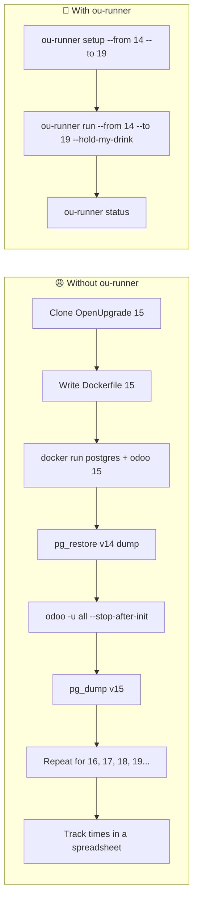
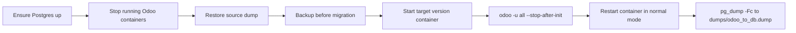
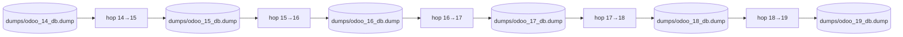

# 🚀 ou-runner

> **One command. Many Odoo majors. Zero hand-holding.**

If you've ever used [OCA/OpenUpgrade][openupgrade] in a Dockerized
setup, you already know the drill: switching branches for every
target major, rebuilding per-version images, hand-rolling `pg_dump`
and `pg_restore` between hops, and keeping a side note of how long
each one took.

`ou-runner` takes that loop off your hands. It walks an Odoo database
from Odoo version **X → Z** one hop at a time, in Docker, with every dump named,
every hop timed, and every artifact in the folder you ran it from.

> **Disclaimer.** Not affiliated with Odoo S.A. or the OCA OpenUpgrade
> project. `ou-runner` wraps [OCA/OpenUpgrade][openupgrade] for
> convenience; the migration scripts themselves belong to OCA.


> **Scope.** `ou-runner` was built and tested against an Odoo 14 → 19
> migration. Earlier majors (≤13) are out of scope — they may work,
> but nothing about the version table, Dockerfile rendering, or
> upgrade-path wiring has been exercised against them.

[openupgrade]: https://github.com/OCA/OpenUpgrade

---

## ✨ Features

- 🐳 **Docker-managed Odoo 14 → 19** — one compose file, one network, six profiles
- 🔄 **Auto-clones OpenUpgrade branches** — no manual `git checkout`
- 💾 **Automated pg_dump between hops** — each hop's output is the next hop's input
- ⏱️ **Built-in migration timing** — `migration_times.json` records every run
- 🍺 **`--hold-my-drink`** — chain every hop from your starting version to the target
- 🧹 **`clean` sweeps everything** — no global state, nothing in your home folder

---

## Without vs. with ou-runner



---

## Install

With [uv](https://docs.astral.sh/uv/) (recommended):

```bash
uv tool install ou-runner
```

Or run it on-demand without installing — `uvx` spins up an ephemeral
environment, runs the command, and gets out of the way:

```bash
uvx ou-runner --help
uvx ou-runner setup --from 14 --to 19
```

Or with pip:

```bash
pip install ou-runner
```

---

## Prerequisites

- **Docker** (Desktop or Engine) running locally.
- **~10 GB free disk** — OpenUpgrade clones and intermediate dumps add up
  fast.
- **A PostgreSQL custom-format dump** of the Odoo 14 database you want to
  migrate (not a plain-text SQL file).
- **Python 3.10+** available to `uv` (or `pip`) when installing.

---

## Quick start

`ou-runner` writes all of its artifacts (dumps, backups, OpenUpgrade
clones, generated Dockerfiles, `docker-compose.yml`,
`migration_times.json`) into the **current working directory**. Pick a
folder per migration:

```bash
mkdir my-odoo-migration && cd my-odoo-migration

# 1. Bootstrap the sandbox for the version range you need.
ou-runner setup --from 14 --to 19

# 2. Drop your v14 dump where ou-runner expects it.
cp /path/to/your_v14_backup.dump dumps/odoo_14_db.dump

# 3. Migrate one hop at a time, testing between each.
ou-runner run --from 14 --to 15
# open http://localhost:8015, log in, smoke-test
ou-runner run --from 15 --to 16
# …

# Or, if you trust the chain end-to-end:
ou-runner run --from 14 --to 19 --hold-my-drink

# At any point:
ou-runner status      # progress chain, dumps, backups, migration times
```

When you're done, `ou-runner clean` sweeps every artifact `setup` and
`run` produced in the current directory. Docker containers and volumes
are not touched — run `docker compose down -v` if you want those gone
too.

> **Tip.** Every `ou-runner …` example below works just as well as
> `uvx ou-runner …` if you'd rather not install the tool globally.

---

## What happens during a hop

Every `ou-runner run --from X --to Y` runs these eight steps in order.
Failures halt the hop and (outside `--hold-my-drink`) drop you into an
interactive prompt so you can inspect, retry, or abort.



---

## Chaining hops with `--hold-my-drink`

OpenUpgrade only supports sequential hops, so going from v14 to v19
means five upgrades. `--hold-my-drink` strings every intermediate hop
together — each hop's dump becomes the next hop's input — and bypasses
interactive prompts so a failure halts the chain cleanly.



---

## Commands

| Command | What it does |
| --- | --- |
| `setup --from <v> --to <v>` | Bootstrap the sandbox: clone OpenUpgrade branches, render Dockerfiles + `docker-compose.yml`. |
| `update` | `git pull` every `openupgrade_<v>/` clone to the latest commits on its branch. |
| `run --from <v> --to <v>` | Run one migration hop. Add `--hold-my-drink` to chain all hops up to `--to`. |
| `start <v>` | Boot a fresh, empty Odoo instance of one version (useful when you want to create a starter dump). |
| `status` | Show the migration's state: progress chain, recorded times, dumps on disk, backups grouped by version. |
| `logs <v> [-f]` | Tail the matching Odoo container's logs. |
| `clean [-y]` | Sweep every artifact `setup`/`run` produced in the current directory. |

Run `ou-runner --help` (or `ou-runner <command> --help`) for full flag
listings.

---

## Versions

| Source | Target | Port | Output dump |
| --- | --- | --- | --- |
| 14 | 15 | 8015 | `dumps/odoo_15_db.dump` |
| 15 | 16 | 8016 | `dumps/odoo_16_db.dump` |
| 16 | 17 | 8017 | `dumps/odoo_17_db.dump` |
| 17 | 18 | 8018 | `dumps/odoo_18_db.dump` |
| 18 | 19 | 8019 | `dumps/odoo_19_db.dump` |

---

## How it works

`ou-runner` is a thin orchestrator — it never touches a database
directly. Under the hood it:

- Clones the [OCA/OpenUpgrade][openupgrade] branches you need into
  `openupgrade_<version>/` folders in your CWD.
- Renders per-version `Dockerfile.openupgrade<N>` files and a single
  `docker-compose.yml` that ties them together.
- Drives `pg_dump`, `pg_restore`, and
  `odoo -u all --stop-after-init --upgrade-path=…` through
  `docker exec`, container by container.
- Records every hop's wall-clock time in `migration_times.json`.

Everything lives in the directory you ran it from. No global state,
nothing in your home folder.

---

## License

MIT — see [LICENSE](./LICENSE).
